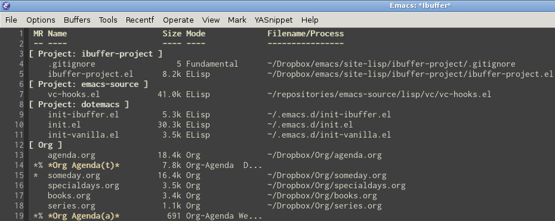

# ibuffer-project

Ibuffer-project creates Ibuffer filtering groups based on path to your
projects. It looks like this:



## Installation

Make sure the file `ibuffer-project.el` is in your load path and put
the following in your .emacs:

```lisp
(require 'ibuffer-project)
(ibuffer-project-refresh t)
```

## Customizations

By default, there is only one path to look for projects that is
`~/.emacs.d`. If you want to add more directories to look for, add
them to `ibuffer-project-alist` before calling
`(ibuffer-project-refresh t)`:

```lisp
(setq ibuffer-project-alist
      '(("Project: %S" "~/repositories"
                       "~/.emacs.d")
        ("Dropbox: %D" "~/Dropbox")))
```

## License

Copyright (C) 2013 Sylvain Rousseau <thisirs at gmail dot com>

Author: Sylvain Rousseau <thisirs at gmail dot com>

This program is free software; you can redistribute it and/or modify
it under the terms of the GNU General Public License as published by
the Free Software Foundation, either version 3 of the License, or
(at your option) any later version.

This program is distributed in the hope that it will be useful,
but WITHOUT ANY WARRANTY; without even the implied warranty of
MERCHANTABILITY or FITNESS FOR A PARTICULAR PURPOSE.  See the
GNU General Public License for more details.

You should have received a copy of the GNU General Public License
along with this program.  If not, see <http://www.gnu.org/licenses/>.
